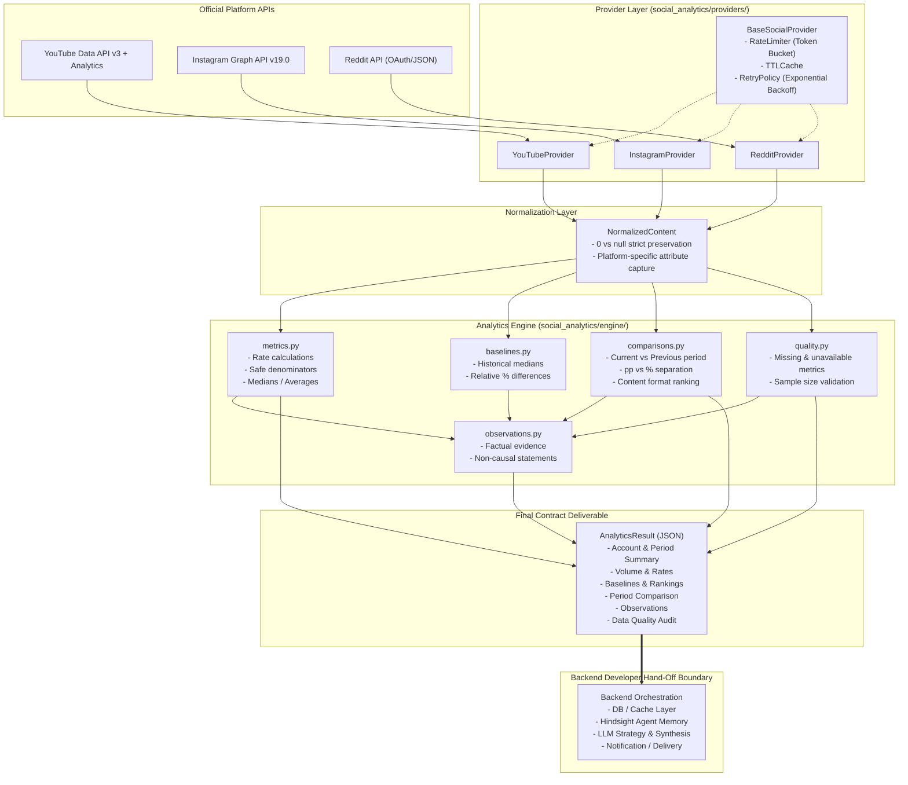

# Architecture & Backend Handoff Guide

## Content Strategy Agent: Social Media Analytics Engine

This document outlines the architecture, component design, and integration guidelines for the **Social Media Analytics Engine** (data & analytics layer).

---

## 1. Architectural Overview & Boundaries



---

## 2. Directory Structure

The engine is encapsulated inside `social_analytics/` without perturbing existing core Hindsight modules:

```text
social_analytics/
├── __init__.py                  # Public exports
├── models/
│   ├── __init__.py
│   ├── normalized.py            # NormalizedContent, AccountInfo, AudienceMetrics
│   └── output.py                # AnalyticsResult contract schema
├── providers/
│   ├── __init__.py
│   ├── base.py                  # BaseSocialProvider, RateLimiter, TTLCache, RetryPolicy
│   ├── youtube.py               # YouTubeProvider adapter
│   ├── instagram.py             # InstagramProvider adapter
│   └── reddit.py                # RedditProvider adapter
├── engine/
│   ├── __init__.py
│   ├── metrics.py               # Deterministic metrics, rate calculations, safe denominators
│   ├── baselines.py             # Historical account baselines & item relative differences
│   ├── comparisons.py           # Period comparison (pp vs %), content-type & topic analysis
│   ├── observations.py          # Deterministic evidence-backed observations
│   ├── quality.py               # Data completeness & sample size audit
│   └── analytics_engine.py      # Master orchestrator
├── fixtures/
│   ├── __init__.py
│   ├── youtube_fixtures.py      # Raw YouTube Data API responses
│   ├── instagram_fixtures.py    # Raw Instagram Graph API responses
│   └── reddit_fixtures.py       # Raw Reddit API responses
└── tests/
    ├── __init__.py
    ├── test_metrics.py          # Rates, medians, growth, zero denominators
    ├── test_baselines.py        # Baseline calculations and relative differences
    ├── test_comparisons.py      # pp vs % distinction, volume changes
    ├── test_normalization.py    # Platform payload conversion & 0 vs null
    ├── test_providers.py        # Rate limiting, caching, retries
    ├── test_quality_and_observations.py # Sample sizes and observations
    └── test_integration.py      # Complete mock -> normalize -> analytics -> JSON flow
```

---

## 3. Resilience & API Limit Handling

External social APIs enforce strict rate limits and can experience transient network failures. The provider architecture incorporates resilience at every level:

1. **Token Bucket Rate Limiting (`RateLimiter`)**:
   - YouTube: default 5.0 RPS
   - Instagram: default 3.0 RPS
   - Reddit: default 1.0 RPS (complies with 60 req/min rule)
2. **In-Memory TTL Caching (`TTLCache`)**:
   - Avoids redundant HTTP calls across repeated analysis requests.
   - Default TTL: 300 seconds (configurable per provider).
3. **Bounded Retries with Exponential Backoff (`RetryPolicy`)**:
   - Maximum 3 retries.
   - Base delay: 0.3s with random jitter to prevent thundering herds.
4. **Deterministic Mock Fallback**:
   - If API credentials are not provided in environment variables, providers seamlessly fall back to realistic mock fixtures, allowing offline testing and development.

---

## 4. How the Backend Developer Consumes the Engine

### Python Integration Example
```python
from datetime import datetime, timezone
from social_analytics.providers import YouTubeProvider, InstagramProvider, RedditProvider
from social_analytics.engine import SocialMediaAnalyticsEngine

# 1. Instantiate the provider (reads credentials from environment variables)
# Environment variables:
# - YouTube: YOUTUBE_API_KEY
# - Instagram: INSTAGRAM_ACCESS_TOKEN
# - Reddit: REDDIT_CLIENT_ID, REDDIT_CLIENT_SECRET
provider = YouTubeProvider()  # Or InstagramProvider(), RedditProvider()

# 2. Instantiate the analytics engine
engine = SocialMediaAnalyticsEngine(provider)

# 3. Execute analysis
result = engine.run_analysis(
    account_id="UC_x5XG1OV2P6uZZ5FSM9Ttw",
    start_date=datetime(2026, 9, 1, tzinfo=timezone.utc),
    end_date=datetime(2026, 9, 30, tzinfo=timezone.utc),
    previous_period_start=datetime(2026, 8, 1, tzinfo=timezone.utc),
    previous_period_end=datetime(2026, 8, 31, tzinfo=timezone.utc),
)

# 4. Access typed attributes or export to clean JSON
print(f"Total posts: {result.content_summary.total_posts}")
print(f"Median ER: {result.content_summary.median_engagement_rate}% ({result.content_summary.engagement_rate_basis})")

# Export as clean JSON dictionary
json_payload = result.model_dump()
```

---

## 5. Test Suite Verification

Run the test suite with:
```bash
python3 -m pytest social_analytics/tests/ -v
```

All 41 unit and end-to-end integration tests execute deterministically and pass in < 0.3s without external network access or live credentials.
