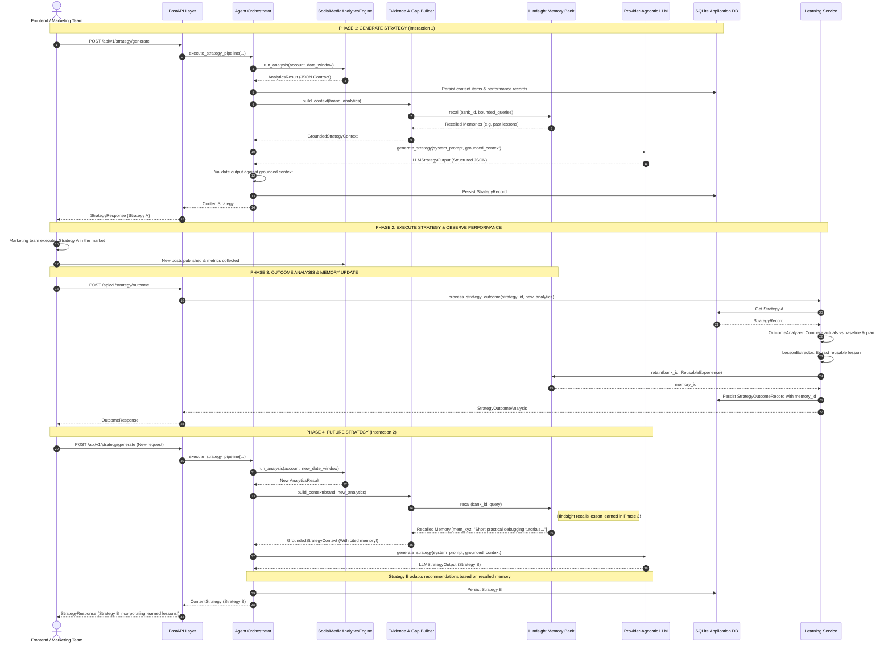

# End-to-End Data Flow Specification

## 1. Complete System Flow Diagram

---

## 2. Segregated Data Envelopes

To prevent model hallucination and mathematical errors, data is strictly segregated into three distinct planes:

| Data Plane | Source | Authority Level | Permitted Operations |
| :--- | :--- | :--- | :--- |
| **Deterministic Facts** | `AnalyticsResult` | Absolute truth (Ground Truth) | Quoting, format ranking, and baseline comparisons. LLM is strictly prohibited from modifying or calculating. |
| **Persistent Memory** | `Hindsight` | Empirical experience | Synthesizing past lessons into editorial guidelines and citing as operational rules. |
| **Hypotheses & Angles** | `LLM Provider` | Generative reasoning | Formulating creative editorial angles, narrative hooks, and experimental hypotheses. |

---

## 3. Database vs Hindsight Record Lifecycle

| Entity | Application DB Store | Hindsight Memory Store |
| :--- | :--- | :--- |
| `BrandProfile` | `brands` table | Bank configuration |
| `NormalizedContent` | `content_items` table | None (avoid raw dumps) |
| Performance Metrics | `content_performances` table | None (avoid raw metrics) |
| Generated Strategy | `strategies` table | Strategy hypothesis reference |
| Post-Mortem Comparison | `strategy_outcomes` table | `strategy_outcome` tag |
| Strategic Lesson | Lesson text column | `ReusableExperience` item |
